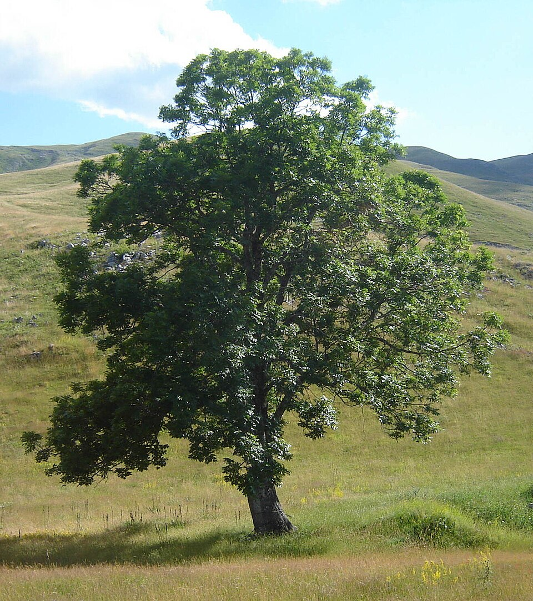

# UniFlora — Campus Flora Information System

<div align="center">
  
</div>

UniFlora is a digital biodiversity platform for a university campus: it documents,
maps, teaches, and helps conserve the campus's plant life. It is built with
**Next.js 15 (App Router) + React 19 + TypeScript**, a **Supabase** (Postgres +
Auth + Storage) backend with Row Level Security enforcing three real user
roles, and an **Upstash Redis** caching/rate-limiting layer — styled with
pixel-faithful inline styles converted from the original HTML mockups
(`*.dc.html` files at the repo root).

> "UniFlora is the Campus Flora Information System — an open digital platform to
> document, map, learn about, and conserve the plant diversity of our university
> campus." — [About page](src/app/about/page.tsx)

Inspired by biodiversity references like Plants of the World Online, World Flora
Online, and GBIF, the goal is to make campus plant knowledge accessible to
students, researchers, conservationists, and the public — for education,
research, and outreach.

## Visual preview

<div align="center">
  
  
</div>

The catalogue also includes curated photographs for representative species,
including [Azadirachta indica](public/plants/azadirachta-indica.jpg),
[Cassia fistula](public/plants/cassia-fistula.jpg), and
[Ficus religiosa](public/plants/ficus-religiosa.jpg).

## What's actually in it

The catalogue is real survey data, not placeholder content: a 2026 floristic
survey of the campus, imported from the botany department's field files.

| Metric | Value |
| --- | --- |
| Species | 355 |
| Families | 81 |
| GPS-mapped individual plants | 2,998 |
| Species photographed | 9 (curated profiles; the rest fall back to type-based artwork) |

See [`scripts/README.md`](scripts/README.md) for exactly how messy field data
(garbled coordinates, encoding issues, unmatched names) is cleaned and reported
rather than silently guessed at.

## Goals

1. **Document** — build a complete, citable species catalogue for the campus
   (taxonomy, diagnostic characters, phenology, ethnobotany, references,
   herbarium vouchers).
2. **Map** — give every recorded individual plant a real GPS location on an
   interactive campus map, organised by zone and plant layer (trees, shrubs,
   herbs).
3. **Learn** — teach identification skills through guides, a glossary,
   manuals, videos, and quizzes.
4. **Conserve** — track native/exotic status and conservation codes to support
   campus biodiversity decisions.
5. **Engage a community of contributors** — let students submit observations,
   contributors verify and curate them, and admins manage the catalogue —
   instead of the data being maintained by one person.

## Tech stack

- **Framework:** Next.js 15 (App Router, Server Actions, Server Components)
- **UI:** React 19, TypeScript, hand-written CSS-in-JS (no Tailwind/UI kit —
  styles were converted 1:1 from the original `.dc.html` mockups)
- **Map:** Leaflet, with OpenStreetMap and Esri World Imagery basemaps
- **Database:** Supabase Postgres (+ PostGIS) — see [`supabase/README.md`](supabase/README.md)
  for the full schema and setup
- **Auth:** Supabase Auth (email/password) — a `profiles` table carries the
  `admin` / `contributor` / `student` role, enforced by Row Level Security on
  every table, not just in the UI
- **Storage:** Supabase Storage (`plant-photos` bucket) for student-submitted
  observation photos
- **Cache/rate limiting:** Upstash Redis — optional, see [`src/lib/redis.ts`](src/lib/redis.ts)
- **AI Assistant:** Optional OpenAI integration with a rule-based local fallback
- **Data pipeline:** Python (`openpyxl`) importer that turns the survey
  spreadsheet + GPS CSV into JSON, then `scripts/migrate-to-supabase.ts` loads
  that JSON into Postgres
- **Data layer:** `src/lib/data.ts` (catalogue/map, Redis-cached) and
  `src/lib/dashboard-data.ts` (submissions/reviews/activity) — every page
  reads through these, none query Supabase directly

## Site map

### Public pages

| Route | Purpose |
| --- | --- |
| [`/`](src/app/page.tsx) | Home — hero, live stats grid, plant-type categories, recently added species |
| [`/explore`](src/app/explore/page.tsx) | Full species browser with search, filters (type, family, cultivated/wild, annual/perennial, mapped-only), sort, and pagination |
| [`/species/[slug]`](src/app/species/[slug]/page.tsx) | Species detail — taxonomy, diagnostic characters, phenology, ethnobotany, references, herbarium voucher, and the AI assistant chat |
| [`/families`](src/app/families/page.tsx) | Browse all 81 plant families, A–Z index |
| [`/families/[slug]`](src/app/families/[slug]/page.tsx) | Family detail — genera, species list, related families |
| [`/map`](src/app/map/page.tsx) | Interactive campus map (Leaflet) — 2,998 GPS-pinned individuals, zone polygons, satellite/street basemap toggle, layer filters |
| [`/collections`](src/app/collections/page.tsx) | Herbarium/voucher specimens with QR codes (shows an empty state today — digitisation hasn't started) |
| [`/gallery`](src/app/gallery/page.tsx) | Photo gallery of photographed species |
| [`/learn`](src/app/learn/page.tsx) | Learning hub: identification keys, glossary, manuals, videos, quizzes, featured guide |
| [`/about`](src/app/about/page.tsx) | Mission and inspiration |
| [`/contact`](src/app/contact/page.tsx) | Contact form |
| [`/login`](src/app/login/page.tsx) | Role-based sign-in (demo accounts, see below) |

### Authenticated dashboards (role-gated by middleware)

Three roles, each with its own sidebar nav and pages, all under `/dashboard/*`:

**Admin** — manage the whole platform
- [Overview](src/app/dashboard/admin/page.tsx), [Species](src/app/dashboard/admin/species/page.tsx), [Users](src/app/dashboard/admin/users/page.tsx), [Approvals](src/app/dashboard/admin/approvals/page.tsx), [Analytics](src/app/dashboard/admin/analytics/page.tsx), [QR Codes](src/app/dashboard/admin/qr/page.tsx)

**Contributor** — curate and verify
- [Overview](src/app/dashboard/contributor/page.tsx), [Review Queue](src/app/dashboard/contributor/reviews/page.tsx), [Specimens](src/app/dashboard/contributor/specimens/page.tsx), [Identifications](src/app/dashboard/contributor/identify/page.tsx), [My Contributions](src/app/dashboard/contributor/contributions/page.tsx)

**Student** — submit and learn
- [Overview](src/app/dashboard/student/page.tsx), [New Observation](src/app/dashboard/student/submit/page.tsx), [My Submissions](src/app/dashboard/student/submissions/page.tsx), [Learning](src/app/dashboard/student/learning/page.tsx), plus a shortcut to the Campus Map

## How authentication works

Real **Supabase Auth**, email/password:

- [`loginAction`](src/app/login/actions.ts) (a Server Action) calls
  `supabase.auth.signInWithPassword`, then checks the signed-in user's
  `profiles.role` matches the role selected on the form (a student account
  can't log in through the admin card, even with correct credentials).
- [`src/middleware.ts`](src/middleware.ts) guards every `/dashboard/*` route
  using `@supabase/ssr`'s session refresh: no signed-in user → redirect to
  `/login`; wrong role for the URL segment → redirect to your own dashboard.
- [`requireRole()`](src/lib/require-role.ts) does the same check inside
  server components for defense in depth — it re-reads the session from
  Supabase rather than trusting the middleware's pass, so a page is safe even
  if it's ever reached without going through middleware.
- [`logoutAction`](src/app/actions/auth.ts) calls `supabase.auth.signOut()`.
- The three demo accounts still work — same emails/passwords as before — but
  they're now real rows in Supabase Auth, seeded by
  [`scripts/seed-demo-users.ts`](scripts/seed-demo-users.ts).
- Every table has Row Level Security on (see [`supabase/README.md`](supabase/README.md)),
  so authorization isn't just a UI check — the database itself refuses a
  student's attempt to, say, update someone else's submission.

## The AI Assistant

Every species page embeds a chat widget ([`PlantAssistant`](src/components/assistant/PlantAssistant.tsx))
answering questions about that specific plant via `POST /api/assistant`
([route](src/app/api/assistant/route.ts)):

- **With `OPENAI_API_KEY` set** (see [`.env.example`](.env.example)): the
  question, chat history, and that plant's full catalogue data are sent to
  OpenAI (`gpt-4o-mini` by default) with a system prompt that scopes answers
  strictly to the supplied plant data.
- **Without a key** (default): a fully local, rule-based responder
  ([`answerPlantQuestion`](src/lib/plant-assistant.ts)) pattern-matches the
  question (identification, medicinal use, flowering season, campus location,
  taxonomy, voucher info, etc.) against the plant's structured fields — no
  external calls, always available.
- If the OpenAI call fails at runtime, the route **falls back to the local
  answer** automatically and flags the response as degraded.

## Data model & pipeline

```
Floristic survey (.xlsx) ─┐
                           ├─▶ scripts/import_flora_data.py ──▶ src/data/generated/*.json
GPS field CSV (D M S)    ─┘                    + src/data/curated.ts (hand-written profiles)
                                                                      │
                                                                      ▼
                                          scripts/migrate-to-supabase.ts
                                                                      │
                                                                      ▼
                                    Supabase Postgres (supabase/migrations/*.sql)
                                                      │                    ▲
                                    src/lib/data.ts ───┘   Redis-cached ───┘ (src/lib/redis.ts)
                                    src/lib/dashboard-data.ts
                                                      │
                                                      ▼
                                                  pages/components
```

- **`npm run import:flora`** re-runs the Python importer (requires
  `openpyxl`), regenerating `families.json`, `species.json`, `markers.json`
  (index-encoded to stay small), `campus.json`, and `import-report.json`
  (everything the importer fixed or rejected — read it after every run).
  This stays the source of truth for the *survey* — re-run it whenever the
  botany department hands off a corrected spreadsheet.
- **`npm run verify:flora`** sanity-checks the decoded map markers.
- **`npm run db:migrate-data`** (needs `SUPABASE_SERVICE_ROLE_KEY`) loads the
  generated JSON + `src/data/curated.ts` into Postgres — safe to re-run,
  every insert is an upsert.
- **`npm run db:seed-users`** creates the 3 demo accounts as real Supabase
  Auth users.
- `src/data/generated/` and `src/data/curated.ts` are the pipeline's
  *inputs* now, not what the live app reads — see
  [`supabase/README.md`](supabase/README.md) for the full migration/RLS
  reference and [`scripts/README.md`](scripts/README.md) for how messy
  survey data (coordinate repair, encoding fixes) is handled before it gets
  there.

## Project structure

```
src/
  app/                  Next.js App Router pages (public + /dashboard/*), Server Actions, API routes
  components/           UI components (map, dashboard, explore/families browsers, assistant, layout)
  data/                 Pipeline inputs only: generated/*.json + curated.ts (read by the migration script)
  lib/
    data.ts             Catalogue/map reads — Supabase-backed, Redis-cached
    dashboard-data.ts   Submissions/reviews/activity/learning-progress reads + writes
    supabase/           Browser/server/middleware Supabase client factories
    redis.ts            Cache-aside wrapper, rate limiter, visitor counter
    auth.ts, require-role.ts   Session/role helpers
  types/                 Shared TypeScript types (auth, assistant, generated Supabase types)
  middleware.ts          Supabase-session-aware role guard for /dashboard
supabase/
  migrations/            Full SQL schema — tables, triggers, RLS policies, storage bucket
  README.md              Setup steps, migration reference, role model
scripts/
  import_flora_data.py    Survey → JSON importer (Python)
  migrate-to-supabase.ts  JSON + curated.ts → Postgres
  seed-demo-users.ts      Creates the 3 demo Supabase Auth accounts
  verify_markers.mjs      Sanity-checks decoded map markers
  probe_tiles.mjs         Checks basemap tile-zoom coverage over campus
  check_*.mjs / shoot_*.mjs / audit_mobile.mjs   Playwright-style visual/QA scripts, screenshots in scripts/shots/
data-templates/         CSV templates matching the importer's expected input shape
*.dc.html               Original pixel-reference HTML mockups (kept unchanged)
```

## Getting started

```bash
npm install
```

1. Create a Supabase project, copy `.env.example` to `.env.local`, fill in
   the three `SUPABASE_*` vars — full steps in
   [`supabase/README.md`](supabase/README.md).
2. Run the migrations (Supabase SQL Editor or `npx supabase db push`), then:
   ```bash
   npm run db:migrate-data   # loads the floristic survey + curated profiles
   npm run db:seed-users     # creates the 3 demo accounts
   ```
3. `npm run dev` and open [http://localhost:3000](http://localhost:3000).

Demo dashboard logins (real Supabase Auth accounts once seeded — see
[`src/types/auth.ts`](src/types/auth.ts)):

| Role | Email | Password |
| --- | --- | --- |
| Admin | `admin@uniflora.edu` | `admin123` |
| Contributor | `curator@uniflora.edu` | `contrib123` |
| Student | `student@uniflora.edu` | `student123` |

Optional env vars (app works without either):
- `OPENAI_API_KEY` — live AI answers on species pages (otherwise the local
  knowledge-base assistant is used automatically).
- `UPSTASH_REDIS_REST_URL` / `UPSTASH_REDIS_REST_TOKEN` — caches the
  catalogue/map reads, rate-limits the AI assistant, and powers the Admin
  Analytics visitor chart. See [`src/lib/redis.ts`](src/lib/redis.ts).

## Roadmap (next)

- Real-time map updates (Supabase Realtime) when an admin edits a marker
- Admin UI for editing species/family taxonomy directly (currently
  read-only in the dashboard; writes go through migrations or SQL)
- Spatial queries using the `postgis` geography columns already on
  `plant_markers`/`campus_zones` (nearest-species search, zone containment)
- Email notifications on submission review (Supabase Auth already has the
  user's email; wire a Postgres webhook or Edge Function)

## Notes

- The `.dc.html` files in the project root are the original design mockups
  used as pixel-reference during the HTML→Next.js conversion; they're kept
  unchanged for comparison.
- `scripts/shots/` contains QA screenshots from responsive/visual regression
  checks (desktop, tablet, mobile) across the main pages and dashboards.

## License

UniFlora is licensed under the [MIT License](LICENSE).
